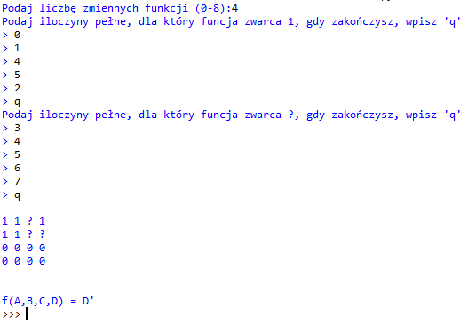

# Karnaugh Map

The program that I made for my end-of-term exam. The license's thesis was "A computer implementation of Karnaugh tables method".
It simplifies functions using this method for up to 8 variables. After getting [minterms](https://en.wikipedia.org/wiki/Canonical_normal_form#Minterm) from user, it returns results and the 2D view of the Karnaugh map.

## How to use it?

The program asks the user for data and based on it, it returns the results.

1. **Firstly program will ask for a number of variables of logical function in range 0-8**
 - if the number is out of range, the prompt will be repeated
 - if the input is not a number the program will terminate
2. **Then the program will ask for all minterms equal to 1**
 - each input is just one minterm - press Enter to add another one
 - the program will be repeating prompt till **q** is typed
 - each minterm is represented by a decimal number in range 0-2n
 - so each number must be in range 0-2n, where n is variables number
 - if it's not, it's going to be simply ignored
 - not an integer or not **q** will crash the program
3. **After that program will ask for irrelevant minterms**
 - irrelevant means they can be equal to 0 or 1 and it won't change the function value
 - this step works exactly like the previous one
 - if given minterm was already declared in the previous step, now it's going to be ignored
 - all minterms not mentioned in this or previous step will be assumed to equal 0
4. **Now program will internally create proper Karnough map and use it to grant the results**
5. **And finally the program will return a 2D view of Karnaugh map and simplified function formula.**

### An example: 
 The minimisation of **f(A,B,C,D)**=Σ(0,1,2,4,5)+uΣ(3,6,7)
1. Variable for the step one will be **4** since there are four variables (A,B,C,D)
2. Variables for step two will be: 0,1,2,4,5 and q (to go to the next step)
3. Variables for step three will be: 3,6,7 and q (to go to the next step)
4. After all variables are given, the program will return the minimized function.

So **f(A,B,C,D) = D'** after being minimized.
